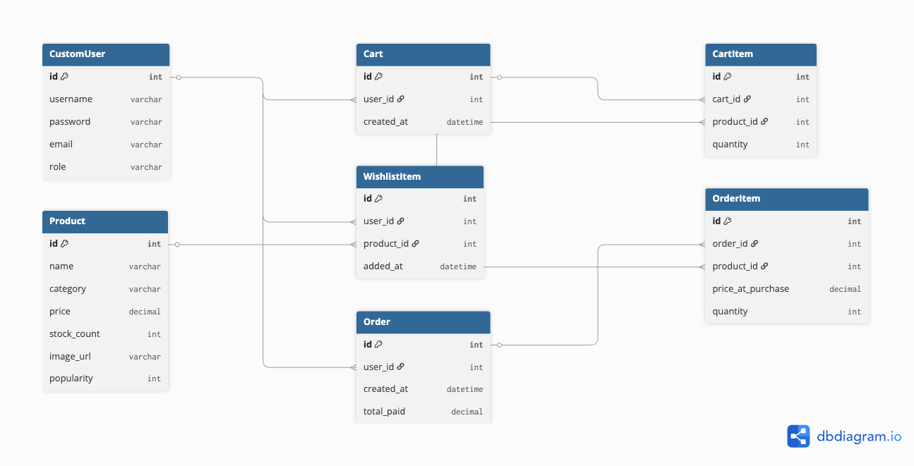

# Online Grocery Store Backend API

This is the backend API for an online grocery store application, built with Django and Django REST Framework. The API supports user authentication, role-based access for customers and store managers, product management, and a full customer shopping workflow from browsing to checkout.

---

## Key Features

### User Management
- **JWT Authentication:** Secure login/register system using JSON Web Tokens.
- **Role-Based Access:**
    - **Customers:** Can browse products, manage their wishlist and cart, and checkout.
    - **Store Managers:** Can manage products (CRUD) and view sales reports.

### Store Manager Features
- **Product Management:** Add, edit, and delete products (name, category, price, stock, image).
- **Sales Report:** View aggregated sales data, with filters for most/least sold products.

### Customer Features
- **Product Browsing:** Publicly accessible product list with filtering by category and sorting by price or popularity.
- **Wishlist:** Save items for later.
- **Shopping Cart:** Add, view, and remove items from a persistent shopping cart.
- **Checkout:** Convert the cart into a permanent order, with stock validation and updates.

---

## API Documentation

A complete, interactive collection of all API endpoints is available through Postman. This documentation allows you to see all requests and even try them out live against the server.

[**View the Postman API Documentation**](https://rupallahre-8693365.postman.co/workspace/Rupal-Lahre's-Workspace~d35841ac-7f83-4249-8896-2ddd433a6860/collection/44138209-90712fc4-f897-4736-b7eb-d592c78b761e?action=share&source=copy-link&creator=44138209)

---

## API Endpoint Quick Guide

| Endpoint | Method | Purpose | Authentication |
| :--- | :--- | :--- | :--- |
| `/api/v1/register/` | `POST` | Register a new user (customer or manager). | Public |
| `/api/v1/token/` | `POST` | Log in to receive a JWT access token. | Public |
| `/api/v1/browse-products/` | `GET` | Browse all available products. | Public |
| `/api/v1/products/` | `GET`, `POST` | List or create products. | Manager Only |
| `/api/v1/products/<id>/` | `PUT`, `DELETE` | Update or delete a specific product. | Manager Only |
| `/api/v1/wishlist/` | `GET` | View the items in your wishlist. | Customer Only |
| `/api/v1/wishlist/add/` | `POST` | Add a product to your wishlist. | Customer Only |
| `/api/v1/wishlist/remove/<id>/` | `DELETE` | Remove an item from your wishlist. | Customer Only |
| `/api/v1/cart/` | `GET`, `POST`, `DELETE` | View, add to, or remove from your cart. | Customer Only |
| `/api/v1/checkout/` | `POST` | Create an order from your cart. | Customer Only |
| `/api/v1/sales-report/` | `GET` | View aggregated product sales data. | Manager Only |

---

## Database Design

The database consists of several interconnected models to manage users, products, and the shopping workflow. The schema is designed to separate concerns like temporary carts from permanent order histories.



---

## Technology Stack

- **Backend:** Django, Django REST Framework
- **Authentication:** Simple JWT (JSON Web Tokens)
- **Database:** SQLite (for development)

---

## Local Setup and Installation

To run this project on your local machine, follow these steps:

1.  **Clone the repository:**
    ```bash
    git clone https://github.com/purplechilliflake/grocery-store.git
    cd grocery-store
    ```

2.  **Create and activate a virtual environment:**
    ```bash
    python -m venv venv
    source venv/bin/activate  # On Windows, use `venv\Scripts\activate`
    ```

3.  **Install the required dependencies:**
    This project includes a `requirements.txt` file to ensure you have all necessary packages.
    ```bash
    pip install -r requirements.txt
    ```

4.  **Apply database migrations:**
    This command sets up the local SQLite database with the correct tables.
    ```bash
    python manage.py migrate
    ```

5.  **Run the development server:**
    ```bash
    python manage.py runserver
    ```

The API will now be running and available at `http://127.0.0.1:8000/`. You can now use the Postman collection to interact with the API.

---